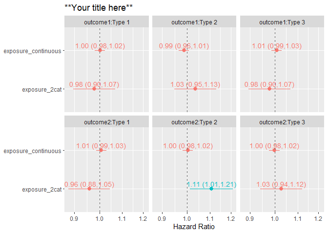

<!-- README.md is generated from README.Rmd. Please edit that file -->

# survtabler

<!-- badges: start -->
<!-- badges: end -->

`survival` package in R is great for interactively and flexibly running
survival models. However, it does not teach a structure for an efficient
workflow. The aim of `survtabler` is to make survival analysis fast,
concise, and intuitive, while keeping the analysis code easy to read.
This is achieved by *function-based* workflow, where many typical steps
(modeling, graphing, analyses of violations of proportional hazards
model) are automated with functions.

## Motivation

Let `example_ti` be a simulated survival data.frame with 8,000
individuals who either experienced an outcome 1 or 2. An analyst would
be interested on an association between exposures `exposure_2cat` and
`exposure_continuous` on two different outcomes (`outcome1` and
`outcome2` - for simplicity here the censoring_time for both of them is
the same). Associations should be adjusted for age (`age`) and HLA DR-DQ
genotype (`hla`) unless models are run only in subgroups defined by the
HLA genotype (DR3/4, DR3/3, and DR4/4).

<details>
<summary>
Here is a typical imperative script that analyzes the data in 129 lines
</summary>

–\>

``` r
library(dplyr)
library(survival)
library(survtabler)
library(stringr)
library(broom)
library(ggplot2)
library(scales)

# Create subgroups used in analyses
example_ti_hla33 <- example_ti %>% filter(hla == "DR3/3") 
example_ti_hla34 <- example_ti %>% filter(hla == "DR3/4") 
example_ti_hla44 <- example_ti %>% filter(hla == "DR4/4") 

# Make models
model_outcome1_exposure2cat_hla33 <- coxph(formula = Surv(cens_time, outcome1) ~ exposure_2cat + age + sex, data = example_ti_hla33)
model_outcome1_exposure2cat_hla34 <- coxph(formula = Surv(cens_time, outcome1) ~ exposure_2cat + age + sex, data = example_ti_hla34)
model_outcome1_exposure2cat_hla44 <- coxph(formula = Surv(cens_time, outcome1) ~ exposure_2cat + age + sex, data = example_ti_hla44)
model_outcome1_exposurecont_hla33 <- coxph(formula = Surv(cens_time, outcome1) ~ exposure_continuous + age + sex, data = example_ti_hla33)
model_outcome1_exposurecont_hla34 <- coxph(formula = Surv(cens_time, outcome1) ~ exposure_continuous + age + sex, data = example_ti_hla34)
model_outcome1_exposurecont_hla44 <- coxph(formula = Surv(cens_time, outcome1) ~ exposure_continuous + age + sex, data = example_ti_hla44)
model_outcome2_exposure2cat_hla33 <- coxph(formula = Surv(cens_time, outcome2) ~ exposure_2cat + age + sex, data = example_ti_hla33)
model_outcome2_exposure2cat_hla34 <- coxph(formula = Surv(cens_time, outcome2) ~ exposure_2cat + age + sex, data = example_ti_hla34)
model_outcome2_exposure2cat_hla44 <- coxph(formula = Surv(cens_time, outcome2) ~ exposure_2cat + age + sex, data = example_ti_hla44)
model_outcome2_exposurecont_hla33 <- coxph(formula = Surv(cens_time, outcome2) ~ exposure_continuous + age + sex, data = example_ti_hla33)
model_outcome2_exposurecont_hla34 <- coxph(formula = Surv(cens_time, outcome2) ~ exposure_continuous + age + sex, data = example_ti_hla34)
model_outcome2_exposurecont_hla44 <- coxph(formula = Surv(cens_time, outcome2) ~ exposure_continuous + age + sex, data = example_ti_hla44)

#assess models
model_outcome1_exposure2cat_hla33
model_outcome1_exposure2cat_hla34
model_outcome1_exposure2cat_hla44
model_outcome1_exposurecont_hla33
model_outcome1_exposurecont_hla34
model_outcome1_exposurecont_hla44
model_outcome2_exposure2cat_hla33
model_outcome2_exposure2cat_hla34
model_outcome2_exposure2cat_hla44
model_outcome2_exposurecont_hla33
model_outcome2_exposurecont_hla34
model_outcome2_exposurecont_hla44

# Analyze proportional hazards assumptions
cox.zph(model_outcome1_exposure2cat_hla33)
cox.zph(model_outcome1_exposure2cat_hla34)
cox.zph(model_outcome1_exposure2cat_hla44)
cox.zph(model_outcome1_exposurecont_hla33)
cox.zph(model_outcome1_exposurecont_hla34)
cox.zph(model_outcome2_exposure2cat_hla33)
cox.zph(model_outcome2_exposure2cat_hla34)
cox.zph(model_outcome2_exposure2cat_hla44)
cox.zph(model_outcome2_exposurecont_hla33)
cox.zph(model_outcome2_exposurecont_hla34)
cox.zph(model_outcome2_exposurecont_hla44)

# Extract Coefficients
model_outcome1_exposure2cat_hla33_coefs <- tidy(model_outcome1_exposure2cat_hla33) %>% 
  mutate(model = "outcome1_exposure2cat_hla33_coefs")
model_outcome1_exposure2cat_hla34_coefs <- tidy(model_outcome1_exposure2cat_hla34) %>% 
  mutate(model = "outcome1_exposure2cat_hla34_coefs")
model_outcome1_exposure2cat_hla44_coefs <- tidy(model_outcome1_exposure2cat_hla44) %>% 
  mutate(model = "outcome1_exposure2cat_hla44_coefs")
model_outcome1_exposurecont_hla33_coefs <- tidy(model_outcome1_exposurecont_hla33) %>% 
  mutate(model = "outcome1_exposurecont_hla33_coefs")
model_outcome1_exposurecont_hla34_coefs <- tidy(model_outcome1_exposurecont_hla34) %>% 
  mutate(model = "outcome1_exposurecont_hla34_coefs")
model_outcome1_exposurecont_hla44_coefs <- tidy(model_outcome1_exposurecont_hla44) %>% 
  mutate(model = "outcome1_exposurecont_hla44_coefs")
model_outcome2_exposure2cat_hla33_coefs <- tidy(model_outcome2_exposure2cat_hla33) %>% 
  mutate(model = "outcome2_exposure2cat_hla33_coefs")
model_outcome2_exposure2cat_hla34_coefs <- tidy(model_outcome2_exposure2cat_hla34) %>% 
  mutate(model = "outcome2_exposure2cat_hla34_coefs")
model_outcome2_exposure2cat_hla44_coefs <- tidy(model_outcome2_exposure2cat_hla44) %>% 
  mutate(model = "outcome2_exposure2cat_hla44_coefs")
model_outcome2_exposurecont_hla33_coefs <- tidy(model_outcome2_exposurecont_hla33) %>% 
  mutate(model = "outcome2_exposurecont_hla33_coefs")
model_outcome2_exposurecont_hla34_coefs <- tidy(model_outcome2_exposurecont_hla34) %>% 
  mutate(model = "outcome2_exposurecont_hla34_coefs")
model_outcome2_exposurecont_hla44_coefs <- tidy(model_outcome2_exposurecont_hla44) %>% 
  mutate(model = "outcome2_exposurecont_hla44_coefs")

#Merge coefficients
coefficients <- model_outcome1_exposure2cat_hla33_coefs %>% 
  full_join(model_outcome1_exposure2cat_hla34_coefs) %>% 
  full_join(model_outcome1_exposure2cat_hla44_coefs) %>% 
  full_join(model_outcome1_exposurecont_hla33_coefs) %>% 
  full_join(model_outcome1_exposurecont_hla34_coefs) %>% 
  full_join(model_outcome1_exposurecont_hla44_coefs) %>% 
  full_join(model_outcome2_exposure2cat_hla33_coefs) %>% 
  full_join(model_outcome2_exposure2cat_hla34_coefs) %>% 
  full_join(model_outcome2_exposure2cat_hla44_coefs) %>% 
  full_join(model_outcome2_exposurecont_hla33_coefs) %>% 
  full_join(model_outcome2_exposurecont_hla34_coefs) %>% 
  full_join(model_outcome2_exposurecont_hla44_coefs)
  
# Create graph data
coefficients <- coefficients %>%
  filter(term %in% c("exposure_2cat", "exposure_continuous")) %>% 
    mutate(sig = ifelse(p.value < 0.05, 1, 0)) %>% 
    mutate(sig = factor(sig, levels = c(0, 1),
                        labels = c("p>=0.05", "p<0.05"))) %>% 
  mutate(model = str_remove(model, "_coefs")) %>% 
  mutate(model = str_remove(model, "exposure2cat_")) %>% 
  mutate(model = str_remove(model, "exposurecont_")) %>% 
  mutate(outcome = str_extract(model, ".*?_")) %>%
  mutate(outcome = str_remove(outcome, "_")) %>% 
  mutate(hla = str_extract(model, "(?<=_).*")) %>% 
  mutate(hla = case_when(
    hla == "hla33" ~ "HLA DR3/3",
    hla == "hla34" ~ "HLA DR3/4",
    hla == "hla44" ~ "HLA DR4/4"))

# Graph
coefficients %>%
    ggplot(aes(x = term, y = exp(estimate),
               ymin = exp(estimate - 1.96 * std.error),
               ymax = exp(estimate + 1.96 * std.error),
               colour = sig)) +
    geom_pointrange() +
    geom_text(aes(label = paste0(sprintf("%.2f", signif(exp(estimate), 3)), " (",
                                 sprintf("%.2f", signif(exp(estimate - 1.96 * std.error), 3)), ",",
                                 sprintf("%.2f", signif(exp(estimate + 1.96 * std.error), 3)), ")")),
              vjust = -0.5,
              size = 3.75) +
    coord_flip() +
    geom_hline(yintercept = 1, linetype = "dashed", colour = "grey40") +
    ylab("Hazard Ratio") +
    xlab(NULL) +
    theme(legend.position = "none") +
    ggtitle("Association between risk of 2 outcomes and 2 exposures in 3 groups defined by HLA DR genotypes") +
    scale_y_continuous(trans = "log", labels = label_number(max_n = 2)) +
  facet_wrap(~factor(outcome):factor(hla))
```

</details>
<details>
<summary>
Here is how that would be analyzed with survtabler in 15 lines (analyzed
in detail below).
</summary>

–\>

``` r
library(survtabler)

#Build a 'survtable' with combinations of survival model data and model formula
survtable_1 <- create_survtable(exposure_vars = c("exposure_2cat", "exposure_continuous"),
                                outcome_vars = c("outcome1", "outcome2"),
                                covariates = "age + sex + hla",
                                submodel_var = "hla",
                                submodel_values = c("DR3/3", "DR3/4", "DR4/4"),
                                time_var = "cens_time",
                                data_name = "example_ti")

#Run all Cox Proportional Hazards models listed in survtable_1
models <- survtable_1 %>% model_survtable()

#Extract coefficients and graph a forrest plot
models %>% get_coefs() %>% 
  graph_coefs()

#Get model metadata
models  %>% get_model_meta()

#Catch models that violate the proportional hazards assumption
models  %>% catch_nonph()
```

</details>

The ‘survtabler way’ takes 88% of less lines of code to write and the
code is way easier to read. The advantage of using survtabler is way
more obvious when the number of model combinations increases to dozens,
hundreds or even thousands. Furthermore, survtabler function-based
scripts are easier to work with when analyses often need to be refined
later. It would be much nicer to e.g. tweak the covariates here in one
line than in possibly dozens.

## Installation

You can install the development version of `survtabler` from
[GitHub](https://github.com/) with:

``` r
install.packages("devtools")
devtools::install_github("jkoskenniemi/survtabler")
```

## Example

Below, we go through the steps of the earlier example in more detail.

The first step is to plan and specify the Survival models that are
analyzed. `create_survtable()` builds a `survtable`, a ‘recipe’
data.frame for survival analyses. Each row specifies everything that is
required by `Survival::coxph()` to run one of the desired Cox
Proportional hazards model: a model formula (`formula`) and analysis
data (`data_name`).

`survtable` is built by specifying the helper function
`create_survtable` the requested exposures (input `expoure_vars`),
outcomes (`outcome_vars`), follow-up time (`time_var`) and analysis data
(`data`). `create_survtable()` then builds all possible combinations of
exposure-outcome-time-data. Optionally, subgroup analyses can be
requested by providing the variable and values (`submodel_var` and
`submodel_values`) that that define subgroup analysis dataset
(i.e. `submodel_var`==`submodel_value1`,
`submodel_var`==`submodel_value2`, `submodel_var`==`submodel_value3`
etc.).

``` r
library(survtabler)
library(dplyr)
#> 
#> Attaching package: 'dplyr'
#> The following objects are masked from 'package:stats':
#> 
#>     filter, lag
#> The following objects are masked from 'package:base':
#> 
#>     intersect, setdiff, setequal, union

#Specify all combinations of exposure, outcome, time variables and data_name
survtable_1 <- 
  create_survtable(exposure_vars = c("exposure_2cat", "exposure_continuous"),
                 outcome_vars = c("outcome1", "outcome2"),
                 covariates = "age + sex + hla",
                 time_var = "cens_time",
                 submodel_var = "hla",
                 submodel_values = c("DR3/3", "DR3/4", "DR4/4"),
                 data_name = "example_ti")
```

``` r
survtable_1 %>% select(data_name, formula)
#> # A tibble: 12 x 2
#>    data_name  formula                                                          
#>    <chr>      <chr>                                                            
#>  1 example_ti Surv(cens_time, outcome1) ~ exposure_2cat + age + sex + hla      
#>  2 example_ti Surv(cens_time, outcome2) ~ exposure_2cat + age + sex + hla      
#>  3 example_ti Surv(cens_time, outcome1) ~ exposure_continuous + age + sex + hla
#>  4 example_ti Surv(cens_time, outcome2) ~ exposure_continuous + age + sex + hla
#>  5 example_ti Surv(cens_time, outcome1) ~ exposure_2cat + age + sex + hla      
#>  6 example_ti Surv(cens_time, outcome2) ~ exposure_2cat + age + sex + hla      
#>  7 example_ti Surv(cens_time, outcome1) ~ exposure_continuous + age + sex + hla
#>  8 example_ti Surv(cens_time, outcome2) ~ exposure_continuous + age + sex + hla
#>  9 example_ti Surv(cens_time, outcome1) ~ exposure_2cat + age + sex + hla      
#> 10 example_ti Surv(cens_time, outcome2) ~ exposure_2cat + age + sex + hla      
#> 11 example_ti Surv(cens_time, outcome1) ~ exposure_continuous + age + sex + hla
#> 12 example_ti Surv(cens_time, outcome2) ~ exposure_continuous + age + sex + hla
```

After the `survtable` has been created, in principle the following steps
(`model_survtable()`, `get_coefs()`, `graph_coefs()`,
`get_model_metadata()`, `catch_nonph()`, can be automated and included
in a single function (to be created). However, they are all are shown
here to show the entire process.

First, each models are fitted and returned as a list

``` r
models <- survtable_1 %>%  
  model_survtable()
```

And then model coefficients are extracted and a forest plot drawn, …

``` r
models  %>%  
  get_coefs()  %>%  #Get coefficients for forrest plots
  graph_coefs(title = "**Your title here**") #Draw forest plots
```



… model metadata extracted, …

``` r
models  %>%  
  get_model_meta()
#>                                                               n n_event
#> outcome1~exposure_2cat|filter(example_ti,hla==DR3/3)       8000    3996
#> outcome2~exposure_2cat|filter(example_ti,hla==DR3/3)       8000    3990
#> outcome1~exposure_continuous|filter(example_ti,hla==DR3/3) 8000    3996
#> outcome2~exposure_continuous|filter(example_ti,hla==DR3/3) 8000    3990
#> outcome1~exposure_2cat|filter(example_ti,hla==DR3/4)       8000    3996
#> outcome2~exposure_2cat|filter(example_ti,hla==DR3/4)       8000    3990
#> outcome1~exposure_continuous|filter(example_ti,hla==DR3/4) 8000    3996
#> outcome2~exposure_continuous|filter(example_ti,hla==DR3/4) 8000    3990
#> outcome1~exposure_2cat|filter(example_ti,hla==DR4/4)       8000    3996
#> outcome2~exposure_2cat|filter(example_ti,hla==DR4/4)       8000    3990
#> outcome1~exposure_continuous|filter(example_ti,hla==DR4/4) 8000    3996
#> outcome2~exposure_continuous|filter(example_ti,hla==DR4/4) 8000    3990
#>                                                            n_missing       data
#> outcome1~exposure_2cat|filter(example_ti,hla==DR3/3)               0 example_ti
#> outcome2~exposure_2cat|filter(example_ti,hla==DR3/3)               0 example_ti
#> outcome1~exposure_continuous|filter(example_ti,hla==DR3/3)         0 example_ti
#> outcome2~exposure_continuous|filter(example_ti,hla==DR3/3)         0 example_ti
#> outcome1~exposure_2cat|filter(example_ti,hla==DR3/4)               0 example_ti
#> outcome2~exposure_2cat|filter(example_ti,hla==DR3/4)               0 example_ti
#> outcome1~exposure_continuous|filter(example_ti,hla==DR3/4)         0 example_ti
#> outcome2~exposure_continuous|filter(example_ti,hla==DR3/4)         0 example_ti
#> outcome1~exposure_2cat|filter(example_ti,hla==DR4/4)               0 example_ti
#> outcome2~exposure_2cat|filter(example_ti,hla==DR4/4)               0 example_ti
#> outcome1~exposure_continuous|filter(example_ti,hla==DR4/4)         0 example_ti
#> outcome2~exposure_continuous|filter(example_ti,hla==DR4/4)         0 example_ti
#>                                                              submodel
#> outcome1~exposure_2cat|filter(example_ti,hla==DR3/3)       hla==DR3/3
#> outcome2~exposure_2cat|filter(example_ti,hla==DR3/3)       hla==DR3/3
#> outcome1~exposure_continuous|filter(example_ti,hla==DR3/3) hla==DR3/3
#> outcome2~exposure_continuous|filter(example_ti,hla==DR3/3) hla==DR3/3
#> outcome1~exposure_2cat|filter(example_ti,hla==DR3/4)       hla==DR3/4
#> outcome2~exposure_2cat|filter(example_ti,hla==DR3/4)       hla==DR3/4
#> outcome1~exposure_continuous|filter(example_ti,hla==DR3/4) hla==DR3/4
#> outcome2~exposure_continuous|filter(example_ti,hla==DR3/4) hla==DR3/4
#> outcome1~exposure_2cat|filter(example_ti,hla==DR4/4)       hla==DR4/4
#> outcome2~exposure_2cat|filter(example_ti,hla==DR4/4)       hla==DR4/4
#> outcome1~exposure_continuous|filter(example_ti,hla==DR4/4) hla==DR4/4
#> outcome2~exposure_continuous|filter(example_ti,hla==DR4/4) hla==DR4/4
```

… and finally models that violate proportionality of the hazards
assumption can be caught (the following example has none).

``` r
models  %>%  
  catch_nonph()
#> [1] chisq    df       p        variable model   
#> <0 rows> (or 0-length row.names)
```
