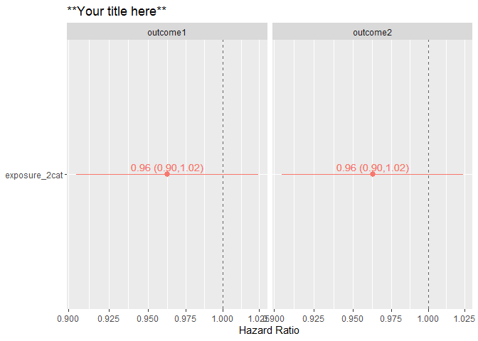

<!-- README.md is generated from README.Rmd. Please edit that file -->

# survtabler

<!-- badges: start -->
<!-- badges: end -->

`survival` packge in R is great. It is allows analyst to run a survival
model with a single piece of code and evaluate the model in various
ways. The goal of the `survtabler` is to guide the user to an easy
workflow based on writing of fast, concise, and easy-to-read code for
surival analyses in R. This is achieved by *function-based* workflow,
where many typical steps (modeling, graphing, analyses of violations of
proporational hazards model) in typical survival analysis is automated
with functions. These functions work, because survtabler enforces the
anlyst to work

## Installation

You can install the development version of survtabler from
[GitHub](https://github.com/) with:

``` r
# install.packages("devtools")
devtools::install_github("jkoskenniemi/survtabler")
```

## Example

This is a basic example which shows you how to solve a common problem:

``` r
library(survtabler)
library(magrittr)

#Specify all combinations of exposure, outcome, time variables and data_name
survtable_1 <- create_survtable(exposure_vars = c("exposure_2cat", "exposure_continuous"),
                 outcome_vars = c("outcome1", "outcome2"),
                 covariates = "age + sex + hla",
                 time_var = "cens_time",
                 data_name = "example_ti") 

#Run Cox proportional hazard models
survtable_1_coxph <- survtable_1 %>%  
  model_survtable()

#Draw forrest plots
survtable_1_coxph %>%  
  get_coefs(c("exposure_2cat", "exposure_continuous"))  %>%  #Get coefficients for forrest plots
  graph_coefs(title = "**Your title here**") #Draw forrest plots
```



``` r

#Get metadata of models
survtable_1_coxph %>%  
  get_model_meta()
#>      n n_event n_missing
#> 1 8000    3996         0
#> 2 8000    3996         0
#> 3 8000    3996         0
#> 4 8000    3996         0
#>                                                                 formula
#> 1 survival::Surv(cens_time, outcome1) ~ exposure_2cat + age + sex + hla
#> 2 survival::Surv(cens_time, outcome1) ~ exposure_2cat + age + sex + hla
#> 3 survival::Surv(cens_time, outcome1) ~ exposure_2cat + age + sex + hla
#> 4 survival::Surv(cens_time, outcome1) ~ exposure_2cat + age + sex + hla

#Catch violations of Cox Proportional hazards assumptions
survtable_1_coxph %>%  
  catch_nonph()
#> [1] chisq    df       p        variable model   
#> <0 rows> (or 0-length row.names)
```
