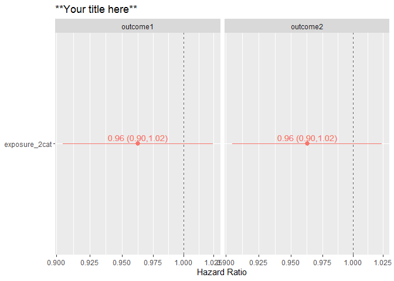

<!-- README.md is generated from README.Rmd. Please edit that file -->

# survtabler

<!-- badges: start -->
<!-- badges: end -->

`survival` package in R is great for interactively and flexibly running
survival models and evaluate the resulting model. However, it does not
“teach” any structure for an efficient workflow, and often leads to
imperative programming and long and complicated analysis scripts. The
aim of `survtabler` is to make survival analysis fast, concise, and
intuitive while keeping the analysis code easy to read. This is achieved
by *function-based* workflow, where many typical steps (modeling,
graphing, analyses of violations of proportional hazards model) are
automated with functions.

## Installation

You can install the development version of `survtabler` from
[GitHub](https://github.com/) with:

``` r
# install.packages("devtools")
# devtools::install_github("jkoskenniemi/survtabler")
```

## Example

The first step is to plan and specify, which Survival models are
analyzed. `create_survtable()` builds a data.frame that includes each
combination of primary exposures of interest (specified in input as
`expoure_vars`), outcomes (`outcome_vars`), follow-up time (`time_var`)
and analysis data (`data`). Optionally, subgroup analyses can be
requested by providing the variable and values that that define subgroup
analyses (`submodel_var` and `submodel_values`).

``` r
library(survtabler)
library(magrittr)
library(dplyr)
#> 
#> Attaching package: 'dplyr'
#> The following objects are masked from 'package:stats':
#> 
#>     filter, lag
#> The following objects are masked from 'package:base':
#> 
#>     intersect, setdiff, setequal, union

#Specify all combinations of exposure, outcome, time variables and data_name
survtable_1 <- create_survtable(exposure_vars = c("exposure_2cat", "exposure_continuous"),
                 outcome_vars = c("outcome1", "outcome2"),
                 covariates = "age + sex + hla",
                 time_var = "cens_time",
                 data_name = "example_ti")
```

`survtable` includes for each row everything that is needed for survival
analyses by `survival::coxph`: data (`data_name`) and model formula
(`formula_str`).

``` r
survtable_1 %>% select(data_name, formula_str)
#> # A tibble: 4 x 2
#>   data_name  formula_str                                                      
#>   <chr>      <chr>                                                            
#> 1 example_ti Surv(cens_time, outcome1) ~ exposure_2cat + age + sex + hla      
#> 2 example_ti Surv(cens_time, outcome2) ~ exposure_2cat + age + sex + hla      
#> 3 example_ti Surv(cens_time, outcome1) ~ exposure_continuous + age + sex + hla
#> 4 example_ti Surv(cens_time, outcome2) ~ exposure_continuous + age + sex + hla
```

After the `survtable` has been created, in principle the following steps
(`model_survtable()`, `get_coefs()`, `graph_coefs()`,
`get_model_metadata()`, `catch_nonph()`, can be automated and included
in a single function (to be created). However, they are all are shown
here to show the entire process.

First, each models are fitted and returned as a list

``` r
models <- survtable_1 %>%  
  model_survtable()
```

And then model coefficients are extracted and a forest plot drawn, …

``` r
models  %>%  
  get_coefs(c("exposure_2cat", "exposure_continuous"))  %>%  #Get coefficients for forrest plots
  graph_coefs(title = "**Your title here**") #Draw forest plots
```



… model metadata extracted, …

``` r
models  %>%  
  get_model_meta()
#>      n n_event n_missing
#> 1 8000    3996         0
#> 2 8000    3990         0
#> 3 8000    3996         0
#> 4 8000    3990         0
#>                                                                       formula
#> 1       survival::Surv(cens_time, outcome1) ~ exposure_2cat + age + sex + hla
#> 2       survival::Surv(cens_time, outcome2) ~ exposure_2cat + age + sex + hla
#> 3 survival::Surv(cens_time, outcome1) ~ exposure_continuous + age + sex + hla
#> 4 survival::Surv(cens_time, outcome2) ~ exposure_continuous + age + sex + hla
```

… and finally models that violate proportionality of the hazards
assumption can be caught (the following example has none).

``` r
models  %>%  
  catch_nonph()
#> [1] chisq    df       p        variable model   
#> <0 rows> (or 0-length row.names)
```
