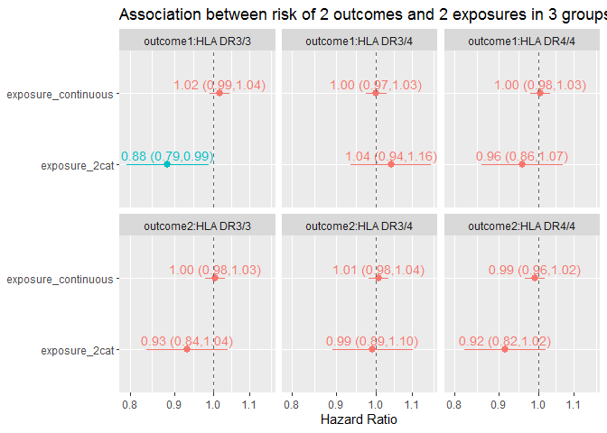
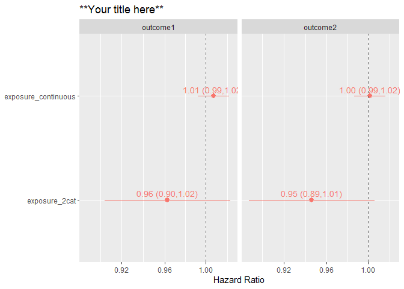

<!-- README.md is generated from README.Rmd. Please edit that file -->

# survtabler

<!-- badges: start -->
<!-- badges: end -->

`survival` package in R is great for interactively and flexibly running
survival models and evaluate the resulting model. However, it does not
“teach” any structure for an efficient workflow, and often leads to
imperative programming and long and complicated analysis scripts. The
aim of `survtabler` is to make survival analysis fast, concise, and
intuitive while keeping the analysis code easy to read. This is achieved
by *function-based* workflow, where many typical steps (modeling,
graphing, analyses of violations of proportional hazards model) are
automated with functions.

## Motivation

<!-- <details> -->
<!--   <summary>Click me</summary> -->

<details>
  <summary> Click here to show a long imperative script that analyzes the data </summary>


``` r
library(dplyr)
#> 
#> Attaching package: 'dplyr'
#> The following objects are masked from 'package:stats':
#> 
#>     filter, lag
#> The following objects are masked from 'package:base':
#> 
#>     intersect, setdiff, setequal, union
library(survival)
library(survtabler)
library(stringr)
library(broom)
library(ggplot2)
library(scales)

# Create subgroups used in analyses
example_ti_hla33 <- example_ti %>% filter(hla == "DR3/3") 
example_ti_hla34 <- example_ti %>% filter(hla == "DR3/4") 
example_ti_hla44 <- example_ti %>% filter(hla == "DR4/4") 

# Make models
model_outcome1_exposure2cat_hla33 <- coxph(formula = Surv(cens_time, outcome1) ~ exposure_2cat + age + sex, data = example_ti_hla33)
model_outcome1_exposure2cat_hla34 <- coxph(formula = Surv(cens_time, outcome1) ~ exposure_2cat + age + sex, data = example_ti_hla34)
model_outcome1_exposure2cat_hla44 <- coxph(formula = Surv(cens_time, outcome1) ~ exposure_2cat + age + sex, data = example_ti_hla44)
model_outcome1_exposurecont_hla33 <- coxph(formula = Surv(cens_time, outcome1) ~ exposure_continuous + age + sex, data = example_ti_hla33)
model_outcome1_exposurecont_hla34 <- coxph(formula = Surv(cens_time, outcome1) ~ exposure_continuous + age + sex, data = example_ti_hla34)
model_outcome1_exposurecont_hla44 <- coxph(formula = Surv(cens_time, outcome1) ~ exposure_continuous + age + sex, data = example_ti_hla44)
model_outcome2_exposure2cat_hla33 <- coxph(formula = Surv(cens_time, outcome2) ~ exposure_2cat + age + sex, data = example_ti_hla33)
model_outcome2_exposure2cat_hla34 <- coxph(formula = Surv(cens_time, outcome2) ~ exposure_2cat + age + sex, data = example_ti_hla34)
model_outcome2_exposure2cat_hla44 <- coxph(formula = Surv(cens_time, outcome2) ~ exposure_2cat + age + sex, data = example_ti_hla44)
model_outcome2_exposurecont_hla33 <- coxph(formula = Surv(cens_time, outcome2) ~ exposure_continuous + age + sex, data = example_ti_hla33)
model_outcome2_exposurecont_hla34 <- coxph(formula = Surv(cens_time, outcome2) ~ exposure_continuous + age + sex, data = example_ti_hla34)
model_outcome2_exposurecont_hla44 <- coxph(formula = Surv(cens_time, outcome2) ~ exposure_continuous + age + sex, data = example_ti_hla44)

#assess models
model_outcome1_exposure2cat_hla33
#> Call:
#> coxph(formula = Surv(cens_time, outcome1) ~ exposure_2cat + age + 
#>     sex, data = example_ti_hla33)
#> 
#>                    coef exp(coef)  se(coef)      z      p
#> exposure_2cat -0.122561  0.884652  0.055551 -2.206 0.0274
#> age           -0.004804  0.995207  0.002731 -1.759 0.0785
#> sexMale        0.037461  1.038171  0.055552  0.674 0.5001
#> 
#> Likelihood ratio test=8.38  on 3 df, p=0.03873
#> n= 2594, number of events= 1302
model_outcome1_exposure2cat_hla34
#> Call:
#> coxph(formula = Surv(cens_time, outcome1) ~ exposure_2cat + age + 
#>     sex, data = example_ti_hla34)
#> 
#>                    coef exp(coef)  se(coef)      z     p
#> exposure_2cat  0.039897  1.040704  0.054196  0.736 0.462
#> age            0.001576  1.001577  0.002736  0.576 0.565
#> sexMale       -0.034368  0.966216  0.054196 -0.634 0.526
#> 
#> Likelihood ratio test=1.3  on 3 df, p=0.7287
#> n= 2715, number of events= 1369
model_outcome1_exposure2cat_hla44
#> Call:
#> coxph(formula = Surv(cens_time, outcome1) ~ exposure_2cat + age + 
#>     sex, data = example_ti_hla44)
#> 
#>                    coef exp(coef)  se(coef)      z     p
#> exposure_2cat -0.042113  0.958762  0.055078 -0.765 0.445
#> age           -0.002792  0.997212  0.002741 -1.018 0.309
#> sexMale        0.008671  1.008709  0.055116  0.157 0.875
#> 
#> Likelihood ratio test=1.6  on 3 df, p=0.6593
#> n= 2691, number of events= 1325
model_outcome1_exposurecont_hla33
#> Call:
#> coxph(formula = Surv(cens_time, outcome1) ~ exposure_continuous + 
#>     age + sex, data = example_ti_hla33)
#> 
#>                          coef exp(coef)  se(coef)      z      p
#> exposure_continuous  0.016695  1.016835  0.013448  1.241 0.2145
#> age                 -0.004562  0.995449  0.002729 -1.672 0.0946
#> sexMale              0.037589  1.038305  0.055578  0.676 0.4988
#> 
#> Likelihood ratio test=5.05  on 3 df, p=0.168
#> n= 2594, number of events= 1302
model_outcome1_exposurecont_hla34
#> Call:
#> coxph(formula = Surv(cens_time, outcome1) ~ exposure_continuous + 
#>     age + sex, data = example_ti_hla34)
#> 
#>                          coef exp(coef)  se(coef)      z     p
#> exposure_continuous  0.001214  1.001215  0.013581  0.089 0.929
#> age                  0.001618  1.001619  0.002737  0.591 0.554
#> sexMale             -0.036272  0.964378  0.054276 -0.668 0.504
#> 
#> Likelihood ratio test=0.77  on 3 df, p=0.8571
#> n= 2715, number of events= 1369
model_outcome1_exposurecont_hla44
#> Call:
#> coxph(formula = Surv(cens_time, outcome1) ~ exposure_continuous + 
#>     age + sex, data = example_ti_hla44)
#> 
#>                          coef exp(coef)  se(coef)      z     p
#> exposure_continuous  0.004904  1.004916  0.013537  0.362 0.717
#> age                 -0.002756  0.997248  0.002742 -1.005 0.315
#> sexMale              0.007753  1.007783  0.055133  0.141 0.888
#> 
#> Likelihood ratio test=1.15  on 3 df, p=0.7657
#> n= 2691, number of events= 1325
model_outcome2_exposure2cat_hla33
#> Call:
#> coxph(formula = Surv(cens_time, outcome2) ~ exposure_2cat + age + 
#>     sex, data = example_ti_hla33)
#> 
#>                    coef exp(coef)  se(coef)      z     p
#> exposure_2cat -0.070739  0.931705  0.055298 -1.279 0.201
#> age           -0.003024  0.996981  0.002718 -1.113 0.266
#> sexMale        0.054874  1.056407  0.055323  0.992 0.321
#> 
#> Likelihood ratio test=3.92  on 3 df, p=0.27
#> n= 2594, number of events= 1312
model_outcome2_exposure2cat_hla34
#> Call:
#> coxph(formula = Surv(cens_time, outcome2) ~ exposure_2cat + age + 
#>     sex, data = example_ti_hla34)
#> 
#>                    coef exp(coef)  se(coef)      z     p
#> exposure_2cat -0.008725  0.991313  0.054499 -0.160 0.873
#> age            0.004376  1.004386  0.002750  1.591 0.112
#> sexMale       -0.069299  0.933048  0.054510 -1.271 0.204
#> 
#> Likelihood ratio test=3.98  on 3 df, p=0.2635
#> n= 2715, number of events= 1353
model_outcome2_exposure2cat_hla44
#> Call:
#> coxph(formula = Surv(cens_time, outcome2) ~ exposure_2cat + age + 
#>     sex, data = example_ti_hla44)
#> 
#>                    coef exp(coef)  se(coef)      z     p
#> exposure_2cat -0.089080  0.914773  0.055102 -1.617 0.106
#> age           -0.001172  0.998829  0.002739 -0.428 0.669
#> sexMale       -0.035015  0.965590  0.055067 -0.636 0.525
#> 
#> Likelihood ratio test=3.27  on 3 df, p=0.3523
#> n= 2691, number of events= 1325
model_outcome2_exposurecont_hla33
#> Call:
#> coxph(formula = Surv(cens_time, outcome2) ~ exposure_continuous + 
#>     age + sex, data = example_ti_hla33)
#> 
#>                          coef exp(coef)  se(coef)      z     p
#> exposure_continuous  0.004880  1.004891  0.013401  0.364 0.716
#> age                 -0.002914  0.997091  0.002716 -1.073 0.283
#> sexMale              0.055671  1.057250  0.055348  1.006 0.314
#> 
#> Likelihood ratio test=2.42  on 3 df, p=0.4902
#> n= 2594, number of events= 1312
model_outcome2_exposurecont_hla34
#> Call:
#> coxph(formula = Surv(cens_time, outcome2) ~ exposure_continuous + 
#>     age + sex, data = example_ti_hla34)
#> 
#>                          coef exp(coef)  se(coef)      z     p
#> exposure_continuous  0.007985  1.008017  0.013651  0.585 0.559
#> age                  0.004336  1.004345  0.002749  1.577 0.115
#> sexMale             -0.071123  0.931347  0.054595 -1.303 0.193
#> 
#> Likelihood ratio test=4.3  on 3 df, p=0.231
#> n= 2715, number of events= 1353
model_outcome2_exposurecont_hla44
#> Call:
#> coxph(formula = Surv(cens_time, outcome2) ~ exposure_continuous + 
#>     age + sex, data = example_ti_hla44)
#> 
#>                          coef exp(coef)  se(coef)      z     p
#> exposure_continuous -0.009250  0.990792  0.013544 -0.683 0.495
#> age                 -0.001022  0.998978  0.002739 -0.373 0.709
#> sexMale             -0.041187  0.959650  0.055074 -0.748 0.455
#> 
#> Likelihood ratio test=1.12  on 3 df, p=0.7725
#> n= 2691, number of events= 1325

# Analyze proportional hazards assumptions
cox.zph(model_outcome1_exposure2cat_hla33)
#>               chisq df    p
#> exposure_2cat 1.683  1 0.19
#> age           0.553  1 0.46
#> sex           0.449  1 0.50
#> GLOBAL        2.635  3 0.45
cox.zph(model_outcome1_exposure2cat_hla34)
#>                chisq df    p
#> exposure_2cat 0.2426  1 0.62
#> age           0.0783  1 0.78
#> sex           0.6880  1 0.41
#> GLOBAL        1.0914  3 0.78
cox.zph(model_outcome1_exposure2cat_hla44)
#>               chisq df    p
#> exposure_2cat 0.342  1 0.56
#> age           3.544  1 0.06
#> sex           0.537  1 0.46
#> GLOBAL        4.512  3 0.21
cox.zph(model_outcome1_exposurecont_hla33)
#>                     chisq df    p
#> exposure_continuous 1.210  1 0.27
#> age                 0.585  1 0.44
#> sex                 0.428  1 0.51
#> GLOBAL              2.335  3 0.51
cox.zph(model_outcome1_exposurecont_hla34)
#>                      chisq df    p
#> exposure_continuous 0.0853  1 0.77
#> age                 0.0700  1 0.79
#> sex                 0.6835  1 0.41
#> GLOBAL              0.9300  3 0.82
cox.zph(model_outcome2_exposure2cat_hla33)
#>               chisq df    p
#> exposure_2cat 0.604  1 0.44
#> age           0.730  1 0.39
#> sex           0.101  1 0.75
#> GLOBAL        1.437  3 0.70
cox.zph(model_outcome2_exposure2cat_hla34)
#>                 chisq df    p
#> exposure_2cat 0.31500  1 0.57
#> age           0.09878  1 0.75
#> sex           0.00135  1 0.97
#> GLOBAL        0.43519  3 0.93
cox.zph(model_outcome2_exposure2cat_hla44)
#>                chisq df     p
#> exposure_2cat 0.3448  1 0.557
#> age           3.4701  1 0.062
#> sex           0.0154  1 0.901
#> GLOBAL        3.8767  3 0.275
cox.zph(model_outcome2_exposurecont_hla33)
#>                      chisq df    p
#> exposure_continuous 0.8184  1 0.37
#> age                 0.7358  1 0.39
#> sex                 0.0925  1 0.76
#> GLOBAL              1.6957  3 0.64
cox.zph(model_outcome2_exposurecont_hla34)
#>                       chisq df    p
#> exposure_continuous 0.16688  1 0.68
#> age                 0.10953  1 0.74
#> sex                 0.00327  1 0.95
#> GLOBAL              0.29418  3 0.96
cox.zph(model_outcome2_exposurecont_hla44)
#>                       chisq df     p
#> exposure_continuous 0.12691  1 0.722
#> age                 3.41734  1 0.065
#> sex                 0.00179  1 0.966
#> GLOBAL              3.58289  3 0.310

# Extract Coefficients
model_outcome1_exposure2cat_hla33_coefs <- tidy(model_outcome1_exposure2cat_hla33) %>% 
  mutate(model = "outcome1_exposure2cat_hla33_coefs")
model_outcome1_exposure2cat_hla34_coefs <- tidy(model_outcome1_exposure2cat_hla34) %>% 
  mutate(model = "outcome1_exposure2cat_hla34_coefs")
model_outcome1_exposure2cat_hla44_coefs <- tidy(model_outcome1_exposure2cat_hla44) %>% 
  mutate(model = "outcome1_exposure2cat_hla44_coefs")
model_outcome1_exposurecont_hla33_coefs <- tidy(model_outcome1_exposurecont_hla33) %>% 
  mutate(model = "outcome1_exposurecont_hla33_coefs")
model_outcome1_exposurecont_hla34_coefs <- tidy(model_outcome1_exposurecont_hla34) %>% 
  mutate(model = "outcome1_exposurecont_hla34_coefs")
model_outcome1_exposurecont_hla44_coefs <- tidy(model_outcome1_exposurecont_hla44) %>% 
  mutate(model = "outcome1_exposurecont_hla44_coefs")
model_outcome2_exposure2cat_hla33_coefs <- tidy(model_outcome2_exposure2cat_hla33) %>% 
  mutate(model = "outcome2_exposure2cat_hla33_coefs")
model_outcome2_exposure2cat_hla34_coefs <- tidy(model_outcome2_exposure2cat_hla34) %>% 
  mutate(model = "outcome2_exposure2cat_hla34_coefs")
model_outcome2_exposure2cat_hla44_coefs <- tidy(model_outcome2_exposure2cat_hla44) %>% 
  mutate(model = "outcome2_exposure2cat_hla44_coefs")
model_outcome2_exposurecont_hla33_coefs <- tidy(model_outcome2_exposurecont_hla33) %>% 
  mutate(model = "outcome2_exposurecont_hla33_coefs")
model_outcome2_exposurecont_hla34_coefs <- tidy(model_outcome2_exposurecont_hla34) %>% 
  mutate(model = "outcome2_exposurecont_hla34_coefs")
model_outcome2_exposurecont_hla44_coefs <- tidy(model_outcome2_exposurecont_hla44) %>% 
  mutate(model = "outcome2_exposurecont_hla44_coefs")

#Merge coefficients
coefficients <- model_outcome1_exposure2cat_hla33_coefs %>% 
  full_join(model_outcome1_exposure2cat_hla34_coefs) %>% 
  full_join(model_outcome1_exposure2cat_hla44_coefs) %>% 
  full_join(model_outcome1_exposurecont_hla33_coefs) %>% 
  full_join(model_outcome1_exposurecont_hla34_coefs) %>% 
  full_join(model_outcome1_exposurecont_hla44_coefs) %>% 
  full_join(model_outcome2_exposure2cat_hla33_coefs) %>% 
  full_join(model_outcome2_exposure2cat_hla34_coefs) %>% 
  full_join(model_outcome2_exposure2cat_hla44_coefs) %>% 
  full_join(model_outcome2_exposurecont_hla33_coefs) %>% 
  full_join(model_outcome2_exposurecont_hla34_coefs) %>% 
  full_join(model_outcome2_exposurecont_hla44_coefs)
#> Joining with `by = join_by(term, estimate, std.error, statistic, p.value,
#> model)`
#> Joining with `by = join_by(term, estimate, std.error, statistic, p.value,
#> model)`
#> Joining with `by = join_by(term, estimate, std.error, statistic, p.value,
#> model)`
#> Joining with `by = join_by(term, estimate, std.error, statistic, p.value,
#> model)`
#> Joining with `by = join_by(term, estimate, std.error, statistic, p.value,
#> model)`
#> Joining with `by = join_by(term, estimate, std.error, statistic, p.value,
#> model)`
#> Joining with `by = join_by(term, estimate, std.error, statistic, p.value,
#> model)`
#> Joining with `by = join_by(term, estimate, std.error, statistic, p.value,
#> model)`
#> Joining with `by = join_by(term, estimate, std.error, statistic, p.value,
#> model)`
#> Joining with `by = join_by(term, estimate, std.error, statistic, p.value,
#> model)`
#> Joining with `by = join_by(term, estimate, std.error, statistic, p.value,
#> model)`
  
# Graph 1
coefficients <- coefficients %>%
  filter(term %in% c("exposure_2cat", "exposure_continuous")) %>% 
    mutate(sig = ifelse(p.value < 0.05, 1, 0)) %>% 
    mutate(sig = factor(sig, levels = c(0, 1),
                        labels = c("p>=0.05", "p<0.05"))) %>% 
  mutate(model = str_remove(model, "_coefs")) %>% 
  mutate(model = str_remove(model, "exposure2cat_")) %>% 
  mutate(model = str_remove(model, "exposurecont_")) %>% 
  mutate(outcome = str_extract(model, ".*?_")) %>%
  mutate(outcome = str_remove(outcome, "_")) %>% 
  mutate(hla = str_extract(model, "(?<=_).*")) %>% 
  mutate(hla = case_when(
    hla == "hla33" ~ "HLA DR3/3",
    hla == "hla34" ~ "HLA DR3/4",
    hla == "hla44" ~ "HLA DR4/4"))
  
coefficients %>%
    ggplot(aes(x = term, y = exp(estimate),
               ymin = exp(estimate - 1.96 * std.error),
               ymax = exp(estimate + 1.96 * std.error),
               colour = sig)) +
    geom_pointrange() +
    geom_text(aes(label = paste0(sprintf("%.2f", signif(exp(estimate), 3)), " (",
                                 sprintf("%.2f", signif(exp(estimate - 1.96 * std.error), 3)), ",",
                                 sprintf("%.2f", signif(exp(estimate + 1.96 * std.error), 3)), ")")),
              vjust = -0.5,
              size = 3.75) +
    coord_flip() +
    geom_hline(yintercept = 1, linetype = "dashed", colour = "grey40") +
    ylab("Hazard Ratio") +
    xlab(NULL) +
    theme(legend.position = "none") +
    ggtitle("Association between risk of 2 outcomes and 2 exposures in 3 groups defined by HLA DR genotypes") +
    scale_y_continuous(trans = "log", labels = label_number(max_n = 2)) +
  facet_wrap(~factor(outcome):factor(hla))
```



<!--  </details> -->

## Installation

You can install the development version of `survtabler` from
[GitHub](https://github.com/) with:

``` r
# install.packages("devtools")
# devtools::install_github("jkoskenniemi/survtabler")
```

## Example

A simple example using simulated data. Using imperative programming, the
analysis require a lot of repetitive writing of same blocks of code, and
would look like this (please suggest if this can be shortened).

</details>

The first step is to plan and specify, which Survival models are
analyzed. `create_survtable()` builds a data.frame that includes each
combination of primary exposures of interest (specified in input as
`expoure_vars`), outcomes (`outcome_vars`), follow-up time (`time_var`)
and analysis data (`data`). Optionally, subgroup analyses can be
requested by providing the variable and values that that define subgroup
analyses (`submodel_var` and `submodel_values`).

``` r


#Specify all combinations of exposure, outcome, time variables and data_name
survtable_1 <- 
  create_survtable(exposure_vars = c("exposure_2cat", "exposure_continuous"),
                 outcome_vars = c("outcome1", "outcome2"),
                 covariates = "age + sex + hla",
                 time_var = "cens_time",
                 data_name = "example_ti")
```

`survtable` includes for each row everything that is needed for survival
analyses by `survival::coxph`: data (`data_name`) and model formula
(`formula_str`).

``` r
survtable_1 %>% select(data_name, formula_str)
#> # A tibble: 4 x 2
#>   data_name  formula_str                                                      
#>   <chr>      <chr>                                                            
#> 1 example_ti Surv(cens_time, outcome1) ~ exposure_2cat + age + sex + hla      
#> 2 example_ti Surv(cens_time, outcome2) ~ exposure_2cat + age + sex + hla      
#> 3 example_ti Surv(cens_time, outcome1) ~ exposure_continuous + age + sex + hla
#> 4 example_ti Surv(cens_time, outcome2) ~ exposure_continuous + age + sex + hla
```

After the `survtable` has been created, in principle the following steps
(`model_survtable()`, `get_coefs()`, `graph_coefs()`,
`get_model_metadata()`, `catch_nonph()`, can be automated and included
in a single function (to be created). However, they are all are shown
here to show the entire process.

First, each models are fitted and returned as a list

``` r
models <- survtable_1 %>%  
  model_survtable()
```

And then model coefficients are extracted and a forest plot drawn, …

``` r
models  %>%  
  get_coefs(c("exposure_2cat", "exposure_continuous"))  %>%  #Get coefficients for forrest plots
  graph_coefs(title = "**Your title here**") #Draw forest plots
```



… model metadata extracted, …

``` r
models  %>%  
  get_model_meta()
#>      n n_event n_missing
#> 1 8000    3996         0
#> 2 8000    3990         0
#> 3 8000    3996         0
#> 4 8000    3990         0
#>                                                                       formula
#> 1       survival::Surv(cens_time, outcome1) ~ exposure_2cat + age + sex + hla
#> 2       survival::Surv(cens_time, outcome2) ~ exposure_2cat + age + sex + hla
#> 3 survival::Surv(cens_time, outcome1) ~ exposure_continuous + age + sex + hla
#> 4 survival::Surv(cens_time, outcome2) ~ exposure_continuous + age + sex + hla
```

… and finally models that violate proportionality of the hazards
assumption can be caught (the following example has none).

``` r
models  %>%  
  catch_nonph()
#> [1] chisq    df       p        variable model   
#> <0 rows> (or 0-length row.names)
```
